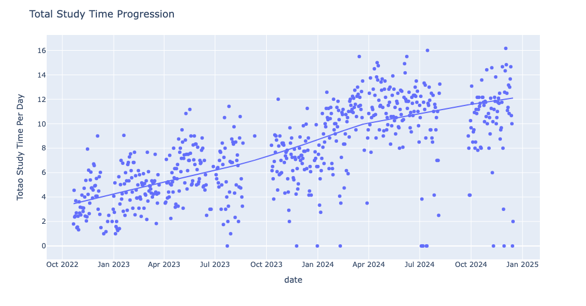
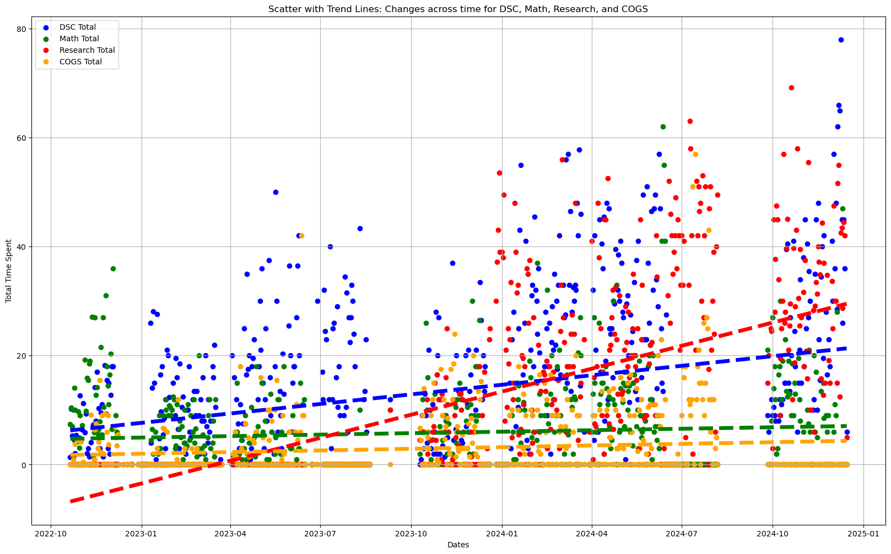
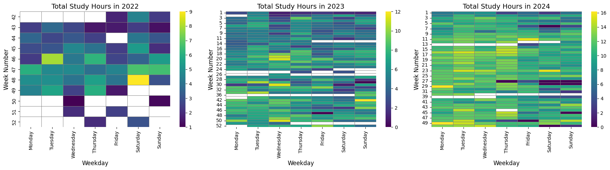
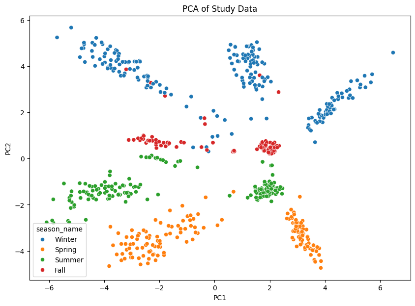
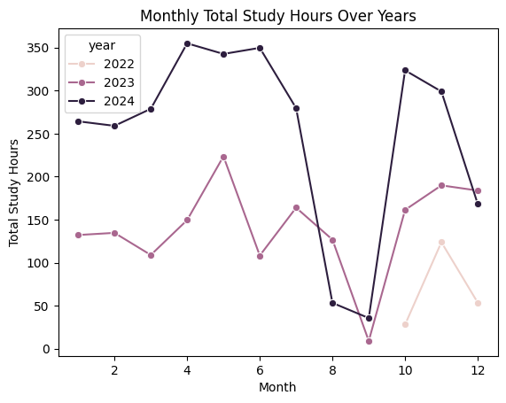
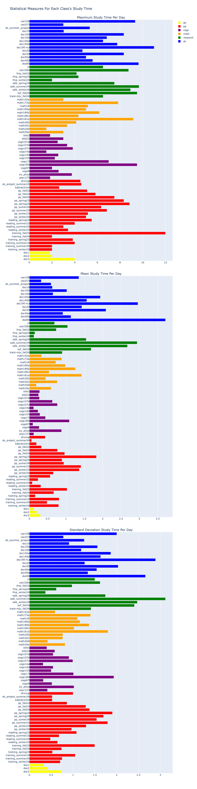

# Kaiwen's "Chatable" Study Database 💬📊
Data in practice, manually collected data and this is a repository for modeling Kevin's study time in UCSD starting from 2022 as a Freshman. Data changes format through out different quarters, becoming more developed and suitable, so merging and some cleaning is needed at first.

- Created `chat` function where it would take all the text in the csv files and shape an large language models' response base on such data.
    - Trying to enhance the language model function by using more embedding data.
    - Need to ensure data integrity.
- Explorative data analysis with numerical data.

# Data Source 📈
Each quarter's data includes one data frame of all the study/work time data and an text feature data frame for the work conducted:
- One almost fully Timestamp + Numerical data frame (`year_quarter_study`) that records all the *study_time*
- One almost fully Timestamp + Text data frame (`year_quarter_text`) that records the precise *study_subject*

 ## Data include:
 1. 2022_fall_study.csv + 2022_fall_text.csv
 2. 2022_winter_study.csv + 2022_winter_text.csv
 3. 2022_spring_study.csv + 2022_spring_text.csv
 4. 2022_summer_study.csv + 2022_summer_text.csv
 5. 2023_fall_study.csv + 2023_fall_text.csv
 6. 2024_winter_study.csv + 2024_winter_text.csv
 7. 2024_spring_study.csv + 2024_spring_text.csv
 8. 2024_summer_study.csv + 2024_summer_text.csv
 9. 2024_fall_study.csv + 2024_fall_text.csv

# Setting Up & Running Chat
Create the conda enviornment by:
```python
conda env create
```

If you want to use GPT with API, you need to create your own OpenAI account and then embed your API key in your system with writing this in your `.bash` file:

```python
export OPENAI_API_KEY = "your api key"
```

Run the following to update system file:

```python
source ~/.bash_profile
```

Enter the conda environment

```python
conda activate ucsd_study
```s

Then run an instance (`chat_with_feedback`) of our chat function by:

```python
python chat/chat_with_feedback.py
```

We have created a few versions of our chat functions:
- `chat_base.py` is the vanill implementation of the chat function.
- `chat_langchain.py` atampts to us  the langchain package (*not working yet*).
- `chat_standard.py` is the currently useful standard version.
- `chat_with_feedcack.py` is `chat_standard.py` but implemented a feedcak for follow up questions, which is much smarter and useful than the standard version.

An example of chat feedback in in [here](https://github.com/KevinBian107/Kaiwen-Study-Database/tree/main/logs)

Demos of chat function:

<div style="width: 100%; display: flex; flex-direction: column; align-items: center;">
  <video controls autoplay style="width: 70%; height: auto;" muted>
    <source src="demos/chat/live_chat.mp4" type="video/mp4">
      Your browser does not support the video tag.
  </video>
  <blockquote>Live "chat" functions for searching</blockquote>
</div>

# General EDA & Temporal Analysis:

<div style="text-align: center;">
    
</div>

<div style="text-align: center;">
    
</div>

<div style="text-align: center;">
    
</div>

<div style="text-align: center;">
    
</div>

<div style="text-align: center;">
    
</div>

<div style="text-align: center;">
    
</div>
