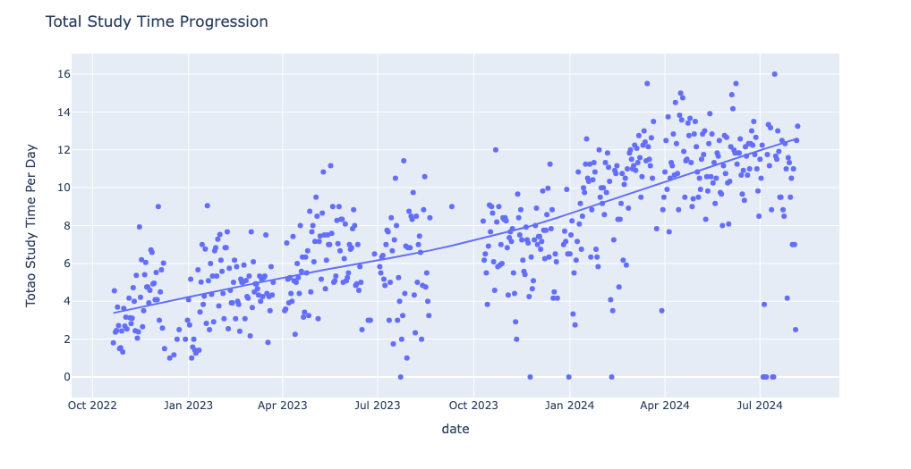
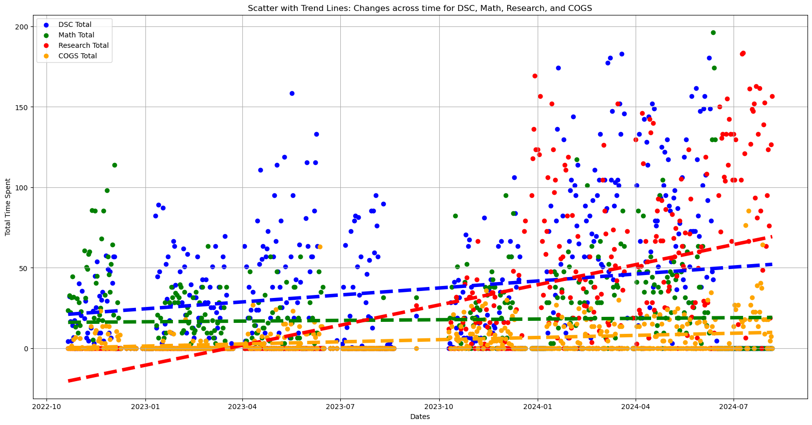
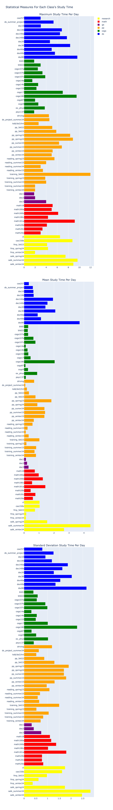

### (In development: small side project)

# Work Hours Analysis 📊
Data in practice, manually collected data and this is a repository for modeling Kevin's study time in UCSD starting from 2022 as a Freshman.

Data changes format through out different quarters, becoming more developed and suitable, so merging and some cleaning is needed at first.

# Data Source 📈
Each quarter's data includes one data frame of all the study/work time data and an text feature data frame for the work conducted:
- One almost fully Timestamp + Numerical data frame (`year_quarter_study`) that records all the *study_time*
- One almost fully Timestamp + Text data frame (`year_quarter_text`) that records the precise *study_subject*

 ## Data include:
 1. 2022_fall_study.csv + 2022_fall_text.csv
 2. 2022_winter_study.csv + 2022_winter_text.csv
 3. 2022_spring_study.csv + 2022_spring_text.csv
 4. 2022_summer_study.csv + 2022_summer_text.csv
 5. 2023_fall_study.csv + 2023_fall_text.csv
 6. 2024_winter_study.csv + 2024_winter_text.csv
 7. 2024_spring_study.csv + 2024_spring_text.csv
 8. 2024_summer_study.csv + 2024_summer_text.csv
 9. 2024_fall_study.csv + 2024_fall_text.csv

# Analysis:
1. for now just simple numerical EDA performed
2. Have textual data, maybe textual analysis later on

    

    

    

